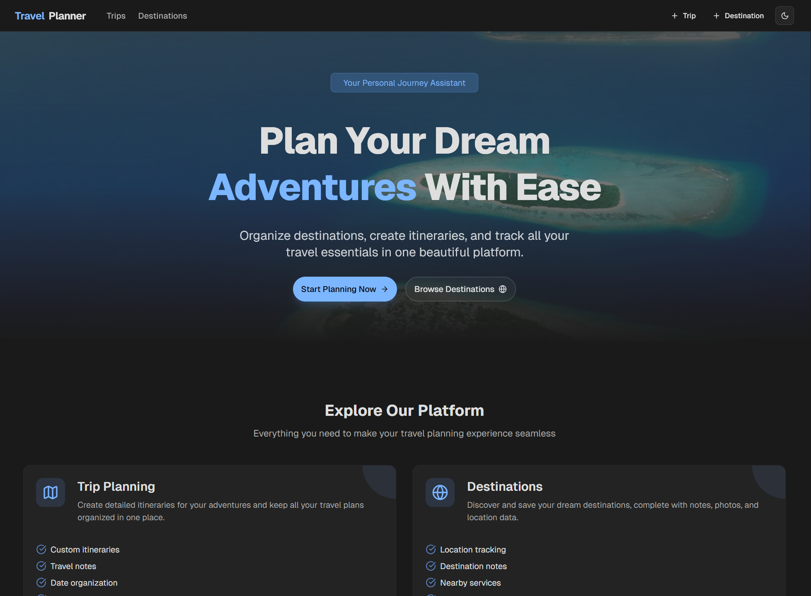

# FWE-SS-25-1117739

# Travel Planning Application

<div align="center">
  
  <p><em>Travel Planning Application Interface</em></p>
</div>

## 🌟 Project Overview

Travel Planning is a comprehensive full-stack application developed for the FWE | SS 2025 course. It enables users to plan and organize their trips by managing destinations, keeping track of packing lists, and finding nearby fuel stations for their travel destinations. The application consists of a backend REST API built with Node.js, Express, and PostgreSQL, and a responsive frontend developed with React, Next.js, and TypeScript.

- Find fuel stations near destinations

## ✨ Features

### Core Features

#### Trip Management

- **CRUD Operations**: Create, read, update, and delete trips
- **Search Functionality**: Search trips by name or date range
- **Trip Details**: View comprehensive information about each trip including destinations, dates, and participants

#### Destination Management

- **CRUD Operations**: Create, read, update, and delete destinations
- **Detailed Information**: Store location information, activities, and photos
- **Geolocation Support**: Store latitude/longitude coordinates for destinations

#### Relationship Management

- **Trip-Destination Relationships**: Each trip can have 0..N destinations, and each destination can belong to 1..N trips
- **Add/Remove Destinations**: Add destinations to trips or remove them with custom date ranges
- **Related Trips View**: View all trips that include a specific destination

#### Frontend Integration

- **List/Detail Views**: Comprehensive views for trips and destinations
- **Search & Filter**: Advanced search capabilities in the frontend
- **Responsive Design**: Mobile-friendly interface
- **Interactive Forms**: User-friendly forms for creating and editing trips/destinations

### Freestyle Features

#### Packing Items Feature (Freestyle Task 1)

- **Trip-Specific Packing Lists**: Create and manage comprehensive packing lists for each trip with item tracking
- **Item Management**:
  - Add custom items with name and quantity
  - Update item quantities directly from the trip detail view
  - Remove individual items
- **Database Integration**:
  - Items are stored in a separate database table with foreign key relationship to trips
  - Cascading deletion when trips are removed

#### Fuel Stations Feature (Freestyle Task 2)

- **Nearby Fuel Stations**:
  - Dynamically discover fuel stations near any destination with geographic coordinates
  - Display ordered by proximity (closest first)
  - Show distance in kilometers from the destination
- **Station Details**:
  - Comprehensive information including station name, address, and distance
  - Display available fuel types (diesel, unleaded, etc.) when provided by the API
  - Show opening hours with special indication for 24/7 stations
  - Formatted address with street, city, and postal code
- **Configurable Radius**:
  - Interactive slider to adjust search radius from 1km to 20km
  - Real-time API requests as radius changes
  - Default 5km radius for initial search
- **Integration with Geoapify API**:
  - Securely connects to external Geoapify Places API
  - Error handling for failed API requests
  - Caching mechanism to reduce redundant API calls

## 🛣️ API Routes

### Trip Routes

| Method   | URL                                        | Description               | Request Body                 | Response              |
| -------- | ------------------------------------------ | ------------------------- | ---------------------------- | --------------------- |
| `GET`    | `/api/trips`                               | Get all trips             | -                            | Array of trip objects |
| `GET`    | `/api/trips/:id`                           | Get a specific trip       | -                            | Trip object           |
| `POST`   | `/api/trips`                               | Create a new trip         | Trip data                    | Created trip          |
| `PUT`    | `/api/trips/:id`                           | Update a trip             | Trip data                    | Updated trip          |
| `DELETE` | `/api/trips/:id`                           | Delete a trip             | -                            | Success message       |
| `GET`    | `/api/trips/search`                        | Search trips by name/date | `?name=&startDate=&endDate=` | Array of trip objects |
| `GET`    | `/api/trips/by-destination/:destinationId` | Get trips by destination  | -                            | Array of trip objects |

### Trip-Destination Relationship Routes

| Method   | URL                                              | Description                  | Request Body   | Response             |
| -------- | ------------------------------------------------ | ---------------------------- | -------------- | -------------------- |
| `POST`   | `/api/trips/:tripId/destinations/:destinationId` | Add destination to trip      | Optional dates | Relationship object  |
| `PUT`    | `/api/trips/:tripId/destinations/:destinationId` | Update trip-destination      | Dates          | Updated relationship |
| `DELETE` | `/api/trips/:tripId/destinations/:destinationId` | Remove destination from trip | -              | Success message      |

### Destination Routes

| Method   | URL                           | Description                 | Request Body     | Response                     |
| -------- | ----------------------------- | --------------------------- | ---------------- | ---------------------------- |
| `GET`    | `/api/destinations`           | Get all destinations        | -                | Array of destination objects |
| `GET`    | `/api/destinations/:id`       | Get a specific destination  | -                | Destination object           |
| `POST`   | `/api/destinations`           | Create a destination        | Destination data | Created destination          |
| `PUT`    | `/api/destinations/:id`       | Update a destination        | Destination data | Updated destination          |
| `DELETE` | `/api/destinations/:id`       | Delete a destination        | -                | Success message              |
| `GET`    | `/api/destinations/:id/trips` | Get trips for a destination | -                | Array of trip objects        |

### Packing Item Routes

| Method   | URL                                | Description                         | Request Body | Response               |
| -------- | ---------------------------------- | ----------------------------------- | ------------ | ---------------------- |
| `GET`    | `/api/packing-items`               | Get all packing items               | -            | Array of packing items |
| `POST`   | `/api/packing-items`               | Create a packing item               | Item data    | Created packing item   |
| `GET`    | `/api/packing-items/:id`           | Get a specific packing item         | -            | Packing item object    |
| `PUT`    | `/api/packing-items/:id`           | Update a packing item               | Item data    | Updated packing item   |
| `DELETE` | `/api/packing-items/:id`           | Delete a packing item               | -            | Success message        |
| `GET`    | `/api/trips/:tripId/packing-items` | Get packing items for a trip        | -            | Array of packing items |
| `DELETE` | `/api/trips/:tripId/packing-items` | Delete all packing items for a trip | -            | Success message        |

### Fuel Station Routes

| Method | URL                                              | Description                          | Query Params   | Response                      |
| ------ | ------------------------------------------------ | ------------------------------------ | -------------- | ----------------------------- |
| `GET`  | `/api/destinations/:destinationId/fuel-stations` | Get fuel stations near a destination | `?radius=5000` | Array of fuel station objects |

## 🏗️ Frontend Structure

The frontend is built with Next.js (App Router) and organized as follows:

### Main Pages

- **Trip List Page (`/trips`)**: Displays all trips with search/filter capabilities
- **Trip Details Page (`/trips/:id`)**: Shows detailed information about a specific trip
- **Trip Creation Page (`/trips/new`)**: Form to create a new trip
- **Trip Edit Page (`/trips/:id/edit`)**: Form to edit an existing trip
- **Destination List Page (`/destinations`)**: Displays all destinations
- **Destination Details Page (`/destinations/:id`)**: Shows detailed information about a specific destination
- **Destination Creation Page (`/destinations/new`)**: Form to create a new destination
- **Destination Edit Page (`/destinations/:id/edit`)**: Form to edit an existing destination

### Key Components

- **Navbar**: Navigation bar for the application
- **Trip Card**: Display summary information for a trip
- **Destination Card**: Display summary information for a destination
- **Packing Item List**: Manage packing items for a trip
- **Fuel Stations**: Display and manage fuel stations near a destination
- **Forms**: Reusable forms for creating/editing trips and destinations
- **Delete Confirmation Dialog**: Confirmation dialog for delete operations

### Backend Integration

The frontend communicates with the backend API using typed service modules:

- `trips-api.ts`: Service for trip-related API calls
- `destinations-api.ts`: Service for destination-related API calls
- `packing-items-api.ts`: Service for packing item API calls

Here’s an improved and more polished version of the **Setup Instructions** section. It’s clearer, better structured, and follows a logical progression with helpful notes:

---

## 🚀 Setup Instructions

### 🧰 Prerequisites

Ensure the following tools are installed:

- **[Docker](https://www.docker.com/)** – used to run the PostgreSQL database via Docker Compose
- **[pnpm](https://pnpm.io/)** – preferred package manager (you may use npm if needed)

---

### 🗃️ Database Setup

Start the PostgreSQL database using Docker:

```bash
# From the root directory
docker compose up -d
```

---

### ⚙️ Configuration

1. Copy the environment example file in `/backend` and create your local environment file:

```bash
cp .env.example .env
```

2. Update the `.env` file according to your Docker Compose setup.

3. **Important**: Set your [Geoapify API key](https://www.geoapify.com/) in the `.env` file to enable the fuel station search functionality:

```env
GEOAPIFY_API_KEY=your_geoapify_api_key
```

_(The API key was sent to you via email.)_

---

### 📦 Installing Dependencies

Install backend and frontend dependencies:

```bash
# Backend
cd backend
pnpm install

# Frontend
cd ../frontend
pnpm install
```

---

### Setup Database

Then, run the database migrations:

```bash
cd backend
pnpm run db:generate     # Optional: generates types based on schema
pnpm run db:migrate      # Applies the latest schema migrations
```

---

### 🏃 Running the Application

Start the backend and frontend in separate terminals:

```bash
# Terminal 1: Start backend server
cd backend
pnpm run dev
```

```bash
# Terminal 2: Start frontend server
cd frontend
pnpm run dev
```

With this setup, the application should now be running locally at:

- **Frontend**: [http://localhost:3000](http://localhost:3000)
- **Backend**: [http://localhost:5001](http://localhost:5001) (or as configured)

## 🧪 Testing the API

### Automated Tests

The project includes Jest tests for the backend API:

```bash
# Run all tests
pnpm test

# Run tests with coverage
pnpm test:coverage
```

### Postman Collection

A Postman collection is included in the repository:

- Location: `/backend/postman_collection.json`
- Import this file into Postman to test all API endpoints

## 💻 Tech Stack

### Backend

- **Framework**: Node.js, Express
- **Database**: PostgreSQL
- **ORM**: Drizzle ORM
- **Testing**: Jest
- **Validation**: Zod
- **External APIs**: Geoapify (for fuel stations data)

### Frontend

- **Framework**: React, Next.js (App Router)
- **Languages**: TypeScript
- **UI Components**: shadcn/ui, radix-ui
- **State Management**: React hooks
- **Styling**: Tailwind CSS

## 🚧 Future Improvements

- User authentication and authorization
- Photo upload capability for destinations
- Interactive maps for destinations
- Trip sharing functionality
- Mobile app version
